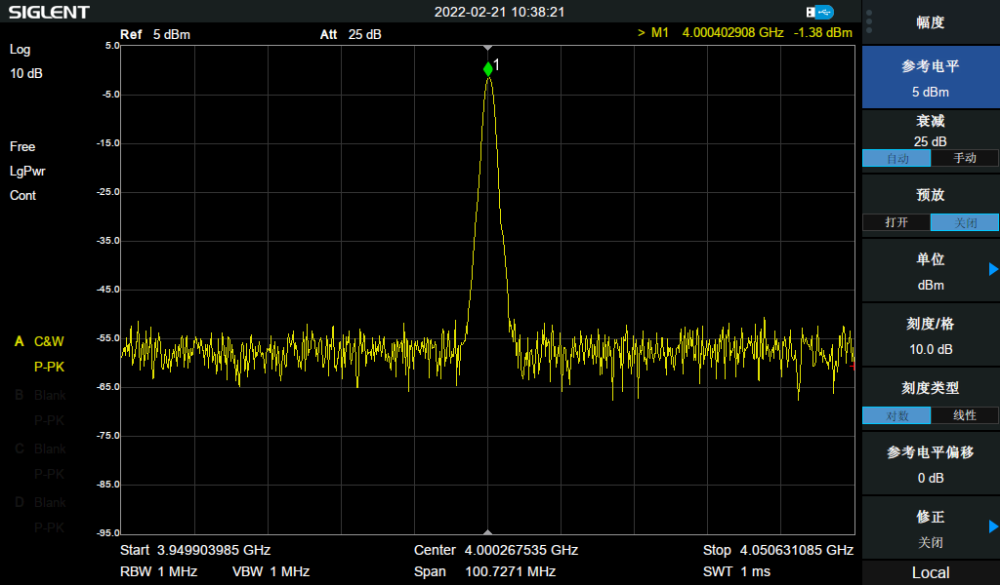
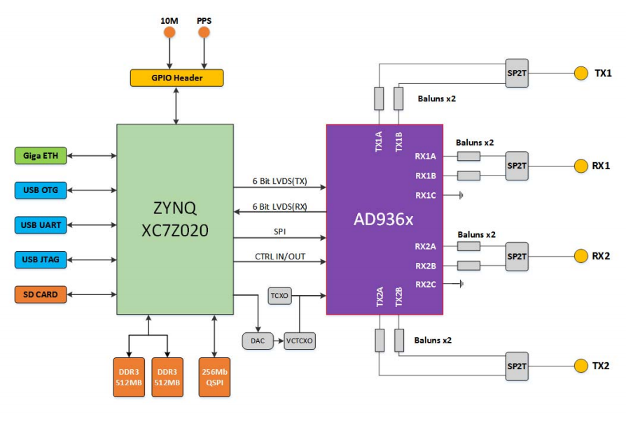

# antsdr_new

This repo transforms the PlutoSDR repo to the antsdr E310 [ANTSDR](https://item.taobao.com/item.htm?id=647986963313#detail) repo and adds additional patches to include
gnuradio and other useful sdr tools.

The aim is to always have the latest firmware for antsdr E310 based on Plutosdr changes

## Purchase Link
For Chinese users: [ANTSDR 淘宝链接](https://item.taobao.com/item.htm?id=647986963313#detail)

For Foreign users : [ANTSDR on AliExpress](https://www.aliexpress.com/item/1005003181244737.html?spm=5261.ProductManageOnline.0.0.15744edfIp5RL0)


## Update Info
- 2022-02-21: Add support for RF switch control to improve transceiver's performance.
  Transmit tone wave at 2GHz:
  
  Transmit tone wave at 4GHz:
  

  RF performance still needs to be further optimized, wish better performance will be available in the next hardware production release. 

- 2021-11-11: The linux kernel update to 5.10. Thanks for [bkerler's](https://github.com/bkerler) excellent work. 

- 2021-07-03: For now, here is a new hardware releases of ANTSDR, the hardware version will be named as **ANTSDR E310**, the older version of **ANTSDR B220** will not be spported any more. For the ANTSDR B220 user, follow the **Build Instructions** to build The corresponding firmware.

## ANTSDR Schematic
The ANTSDR E310 schematic is in the [schematic folder](./schematic),  you can find the hardware design here.


## Build Instructions

- Install dependencies

!!! Make sure Xilinx Vivado Standard 2021.1 is installed to /opt/Xilinx. Also make sure that the Xilinx Vivado SDK 2019.1 is installed to /opt/Xilinx/SDK. !!!

```bash
git clone https://github.com/bkerler/antsdr_new
cd antsdr_new
./install_dependencies.sh
./update_submodules.sh
```

- Install patches needed for antsdr

```bash
./patch_antsdr.sh
```

If you like to add other stuff like gnuradio and some sdr goodies, then run also :

```bash
./patch_additional.sh
```

- Building
```bash
source ./prepare.sh
make -j `nproc`
```

- Make SD card boot image
After the firmware building finished, you can build the SD card boot image for [ANTSDR](https://item.taobao.com/item.htm?spm=a230r.1.14.16.34e21142YIlxqx&id=647986963313&ns=1&abbucket=2#detail). Just type the following command.
```bash
make sdimg
```
You will see the SD boot image in the build_sdimg folder. You can just copy all these files in that folder into a SD card, plug the SD card into the ANTSDR, set the jumper into SD card boot mode.


## Build Artifacts

After the firmware building finished, you will see below file in the build folder. These files are used for flash updating.
```bash 
wcc@wcc-dev:~/wcc/ansdr-fw$ ls -AGhl build 
总用量 315M
-rw-rw-r-- 1 wcc  12M 7月   8 09:32 ant.dfu
-rw-rw-r-- 1 wcc  12M 7月   8 09:36 ant.frm
-rw-rw-r-- 1 wcc   33 7月   8 09:36 ant.frm.md5
-rw-rw-r-- 1 wcc  12M 7月   8 09:32 ant.itb
-rw-rw-r-- 1 wcc  20M 7月   8 09:36 antsdr-fw-v0.33-21-gd72e-dirty.zip
-rw-rw-r-- 1 wcc 677K 7月   8 09:36 antsdr-jtag-bootstrap-v0.33-21-gd72e-dirty.zip
-rw-rw-r-- 1 wcc   69 7月   8 09:36 boot.bif
-rw-rw-r-- 1 wcc 508K 7月   8 09:36 boot.bin
-rw-rw-r-- 1 wcc 508K 7月   8 09:36 boot.dfu
-rw-rw-r-- 1 wcc 637K 7月   8 09:36 boot.frm
-rw-rw-r-- 1 wcc 242M 7月   8 09:37 legal-info-v0.33-21-gd72e-dirty.tar.gz
-rw-rw-r-- 1 wcc 527K 7月   8 09:27 LICENSE.html
-rw-rw-r-- 1 wcc 535K 7月   8 09:29 ps7_init.c
-rw-rw-r-- 1 wcc 534K 7月   8 09:29 ps7_init_gpl.c
-rw-rw-r-- 1 wcc 4.2K 7月   8 09:29 ps7_init_gpl.h
-rw-rw-r-- 1 wcc 4.8K 7月   8 09:29 ps7_init.h
-rw-rw-r-- 1 wcc 2.8M 7月   8 09:29 ps7_init.html
-rw-rw-r-- 1 wcc  36K 7月   8 09:29 ps7_init.tcl
-rw-r--r-- 1 wcc 5.4M 7月   8 09:29 rootfs.cpio.gz
drwxrwxr-x 6 wcc 4.0K 7月   8 09:31 sdk
-rw-rw-r-- 1 wcc 2.2M 7月   8 09:32 system_top.bit
-rw-rw-r-- 1 wcc 591K 7月   8 09:29 system_top.hdf
-rwxrwxr-x 1 wcc 471K 7月   8 09:36 u-boot.elf
-rw-rw---- 1 wcc 128K 7月   8 09:36 uboot-env.bin
-rw-rw---- 1 wcc 129K 7月   8 09:36 uboot-env.dfu
-rw-rw-r-- 1 wcc 6.9K 7月   8 09:36 uboot-env.txt
-rwxrwxr-x 1 wcc 3.9M 7月   8 09:24 zImage
-rw-rw-r-- 1 wcc  17K 7月   8 09:29 zynq-ant-sdr.dtb
-rw-rw-r-- 1 wcc  17K 7月   8 09:29 zynq-ant-sdr-revb.dtb
-rw-rw-r-- 1 wcc  17K 7月   8 09:29 zynq-ant-sdr-revc.dtb
```


## Update Flash by DFU
The ANTSDR also support flash boot mode. You can update the flash by DFU. Set the jumper into Flash Boot mode. When ANTSDR is power up, push the DFU button, and then, you will see the both led in the ANTSDR will turn green, now it's time to update the flash.
You should change into the build folder first,and plug a micro USB into the OTG interface. After that, you should run the following command.
```bash
sudo dfu-util -a firmware.dfu -D ./ant.dfu
sudo dfu-util -a boot.dfu -D ./boot.dfu
sudo dfu-util -a uboot-env.dfu -D ./uboot-env.dfu
sudo dfu-util -a uboot-extra-env.dfu -U ./uboot-extra-env.dfu
```
Now you can repower ANTSDR. 

### boot information for pluto firmware
When ANTSDR is powered on, you can see the following message in serial port terminal.

```
U-Boot PlutoSDR v0.20-PlutoSDR-dirty-00055-g469a0fd988-dirty (Jul 13 2021 - 17:53:36 +0800)

I2C:   ready
DRAM:  ECC disabled 1 GiB
MMC:   sdhci@e0100000: 0
SF: Detected W25Q256 with page size 256 Bytes, erase size 4 KiB, total 32 MiB
*** Warning - bad CRC, using default environment

In:    serial@e0001000
Out:   serial@e0001000
Err:   serial@e0001000
Model: ANT SDR Board Test
reading uEnv.txt
7055 bytes read in 30 ms (229.5 KiB/s)
Importing environment from SD ...
Hit any key to stop autoboot:  0
Device: sdhci@e0100000
Manufacturer ID: 2
OEM: 544d
Name: SA16G
Tran Speed: 50000000
Rd Block Len: 512
SD version 3.0
High Capacity: Yes
Capacity: 14.4 GiB
Bus Width: 4-bit
Erase Group Size: 512 Bytes
reading uEnv.txt
7055 bytes read in 30 ms (229.5 KiB/s)
Loaded environment from uEnv.txt
Importing environment from SD ...
Copying Linux from SD to RAM...
reading uImage
4019688 bytes read in 365 ms (10.5 MiB/s)
reading devicetree.dtb
16967 bytes read in 32 ms (517.6 KiB/s)
reading uramdisk.image.gz
5709113 bytes read in 508 ms (10.7 MiB/s)
## Booting kernel from Legacy Image at 02080000 ...
   Image Name:   Linux-4.19.0-g6edc6cd24b48-dirty
   Image Type:   ARM Linux Kernel Image (uncompressed)
   Data Size:    4019624 Bytes = 3.8 MiB
   Load Address: 00008000
   Entry Point:  00008000
   Verifying Checksum ... OK
## Loading init Ramdisk from Legacy Image at 04000000 ...
   Image Name:
   Image Type:   ARM Linux RAMDisk Image (gzip compressed)
   Data Size:    5709049 Bytes = 5.4 MiB
   Load Address: 00000000
   Entry Point:  00000000
   Verifying Checksum ... OK
## Flattened Device Tree blob at 02000000
   Booting using the fdt blob at 0x2000000
   Loading Kernel Image ... OK
   Loading Ramdisk to 1fa8e000, end 1ffffcf9 ... OK
   Loading Device Tree to 1fa86000, end 1fa8d246 ... OK

Starting kernel ...

Booting Linux on physical CPU 0x0
......
......
......

Welcome to ANTSDR
pluto login:

```
Then you can input 
username :root
password : analog

```

Welcome to ANTSDR
ant login: root
Password:
Welcome to:
    ___    _   _____________ ____  ____
   /   |  / | / /_  __/ ___// __ \/ __ \
  / /| | /  |/ / / /  \__ \/ / / / /_/ /
 / ___ |/ /|  / / /  ___/ / /_/ / _, _/
/_/  |_/_/ |_/ /_/  /____/_____/_/ |_|

e310_v1.0-9-g014a-dirty
https://github.com/MicroPhase/antsdr-fw
# uname -a
Linux ant 5.10.0-97859-g8b0d44b63524 #3 SMP PREEMPT Thu Nov 11 16:20:04 CST 2021 armv7l GNU/Linux
```

The antsdr has an ethernet port, so you can connect the antsdr to your SDR sofware through ethernet cable. The default IP address for ethernet port is **192.168.1.10**.

```
# ifconfig
eth0      Link encap:Ethernet  HWaddr 00:0A:35:00:01:22
          inet addr:192.168.1.10  Bcast:0.0.0.0  Mask:255.255.255.0
          UP BROADCAST MULTICAST  MTU:1500  Metric:1
          RX packets:0 errors:0 dropped:0 overruns:0 frame:0
          TX packets:0 errors:0 dropped:0 overruns:0 carrier:0
          collisions:0 txqueuelen:1000
          RX bytes:0 (0.0 B)  TX bytes:0 (0.0 B)
          Interrupt:28 Base address:0xb000

lo        Link encap:Local Loopback
          inet addr:127.0.0.1  Mask:255.0.0.0
          UP LOOPBACK RUNNING  MTU:65536  Metric:1
          RX packets:0 errors:0 dropped:0 overruns:0 frame:0
          TX packets:0 errors:0 dropped:0 overruns:0 carrier:0
          collisions:0 txqueuelen:1000
          RX bytes:0 (0.0 B)  TX bytes:0 (0.0 B)

usb0      Link encap:Ethernet  HWaddr 00:05:F7:19:E7:93
          inet addr:192.168.2.1  Bcast:0.0.0.0  Mask:255.255.255.0
          UP BROADCAST MULTICAST  MTU:1500  Metric:1
          RX packets:0 errors:0 dropped:0 overruns:0 frame:0
          TX packets:0 errors:0 dropped:0 overruns:0 carrier:0
          collisions:0 txqueuelen:1000
          RX bytes:0 (0.0 B)  TX bytes:0 (0.0 B)
```


## More than pluto
Have you ever used [FMCOMMS2/3/4](https://wiki.analog.com/resources/eval/user-guides/ad-fmcomms2-ebz/quickstart/zynq) before? Have you ever thought about making ANTSDR into a similar device mentioned above?

ANTSDR has the potential to become such a device!

ADI officially supported FMCOMMS2/3/4 devices are usually required to work with Xilinx evaluation boards. ANTSDR has devices similar to them, so a simple modification is needed to make [FMCOMMS2/3/4 image](https://wiki.analog.com/resources/tools-software/linux-software/zynq_images) run on ANTSDR.

It's easy to build the FMCOMMS2/3/4 SD card images for ANTSDR, you can build the sd card image from scratch, which means you should rebuild the fpga project, generate the u-boot file, compile the linux kernel and devicetree, choose rootfs files for your system and so on.

We have built the necessary file to boot the linux kernel, and released these file with recent github release [FMCOMMS2/3/4 Firmware for ANTSDR](https://github.com/MicroPhase/antsdr-fw/releases/tag/e310_v1.0).

The easiest way to make ANTSDR running FMCOMMS2/3/4 image could follow these steps:

- Download a pre-build images from ADI, such as [2019_R1-2020_06_22.img](http://swdownloads.analog.com/cse/2019_R1-2020_06_22.img.xz).

- Prepare an SD card and burn the extracted image to the SD card.

- Once the image is burned into the sd card, you can find BOOT partition and rootfs partition.

- Copy the Release file (BOOT.bin, uImage, devicetree) form our [release](https://github.com/MicroPhase/antsdr-fw/releases/tag/e310_v1.0) into the BOOT partition.

- Insert your SD card into ANTSDR, set the jumper into SD card boot mode, connect a usb to the uart and then power on the ANTSDR. You will get the following message from your serial port terminal.

    ```
    U-Boot 2018.01-21439-gd244ce5869-dirty (Aug 16 2021 - 20:26:35 +0800)
    
    Model: Zynq ANTSDR E310
    Board: Xilinx Zynq
    Silicon: v3.1
    DRAM:  ECC disabled 1 GiB
    MMC:   sdhci@e0100000: 0 (SD)
    SF: Detected w25q256 with page size 256 Bytes, erase size 4 KiB, total 32 MiB
    *** Warning - bad CRC, using default environment
    
    In:    serial@e0001000
    Out:   serial@e0001000
    Err:   serial@e0001000
    Net:   ZYNQ GEM: e000b000, phyaddr 0, interface rgmii-id
    eth0: ethernet@e000b000
    reading uEnv.txt
    392 bytes read in 10 ms (38.1 KiB/s)
    Importing environment from SD ...
    Hit any key to stop autoboot:  0
    Device: sdhci@e0100000
    Manufacturer ID: 2
    OEM: 544d
    Name: SA16G
    Tran Speed: 50000000
    Rd Block Len: 512
    SD version 3.0
    High Capacity: Yes
    Capacity: 14.4 GiB
    Bus Width: 4-bit
    Erase Group Size: 512 Bytes
    reading uEnv.txt
    392 bytes read in 11 ms (34.2 KiB/s)
    Loaded environment from uEnv.txt
    Importing environment from SD ...
    Running uenvcmd ...
    Copying Linux from SD to RAM...
    reading uImage
    6484280 bytes read in 373 ms (16.6 MiB/s)
    reading devicetree.dtb
    20057 bytes read in 17 ms (1.1 MiB/s)
    ** Unable to read file uramdisk.image.gz **
    ## Booting kernel from Legacy Image at 03000000 ...
    Image Name:   Linux-4.19.0-ga6ef26d
    Image Type:   ARM Linux Kernel Image (uncompressed)
    Data Size:    6484216 Bytes = 6.2 MiB
    Load Address: 00008000
    Entry Point:  00008000
    Verifying Checksum ... OK
    ## Flattened Device Tree blob at 02a00000
    Booting using the fdt blob at 0x2a00000
    Loading Kernel Image ... OK
    Loading Device Tree to 1fff8000, end 1ffffe58 ... OK
    
    Starting kernel ...
    
    Booting Linux on physical CPU 0x0
    
    ......
    ......
    ......


    root@analog:~#
    ```
- Now you can use a ethernet cable connect to ANTSDR, and add ANTSDR to your software,such as Matlab2020.b and GNU Radio. With this image, ANTSDR could support 2r2t mode.
